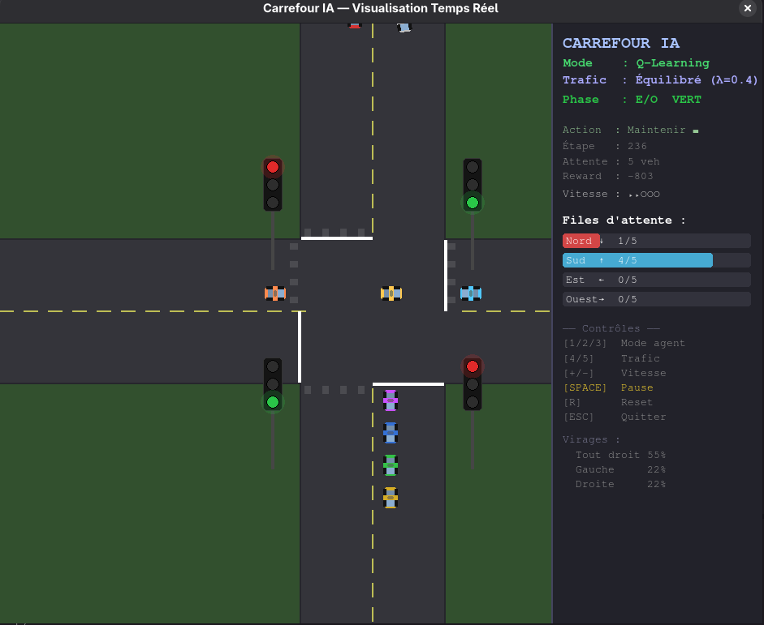
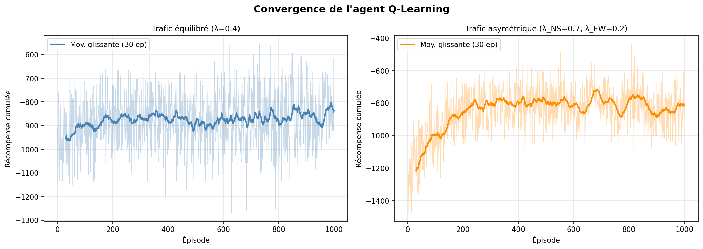
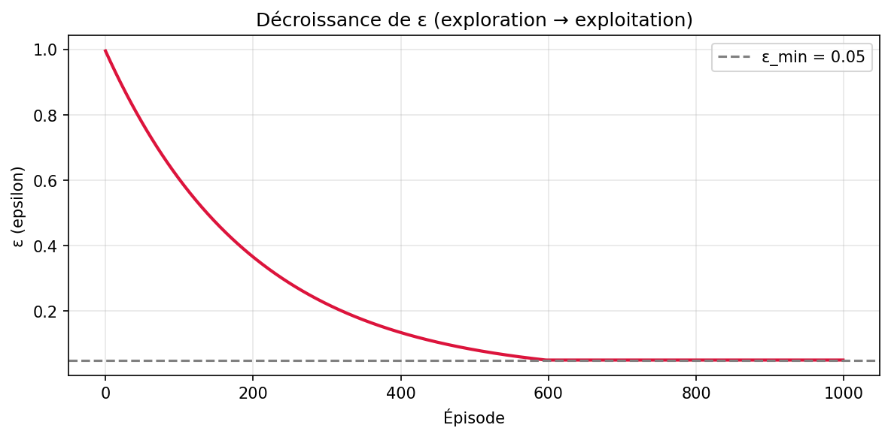
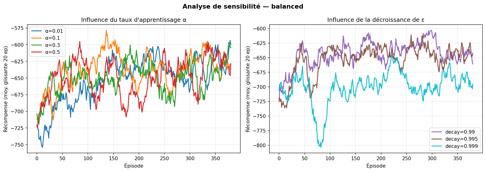
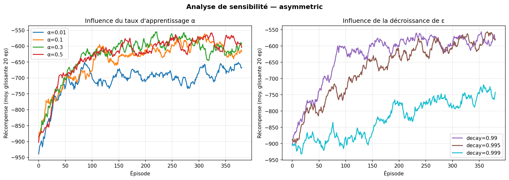
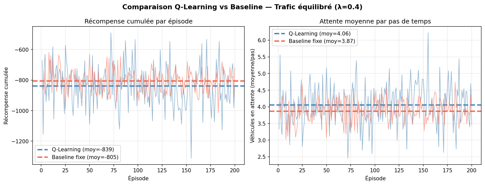
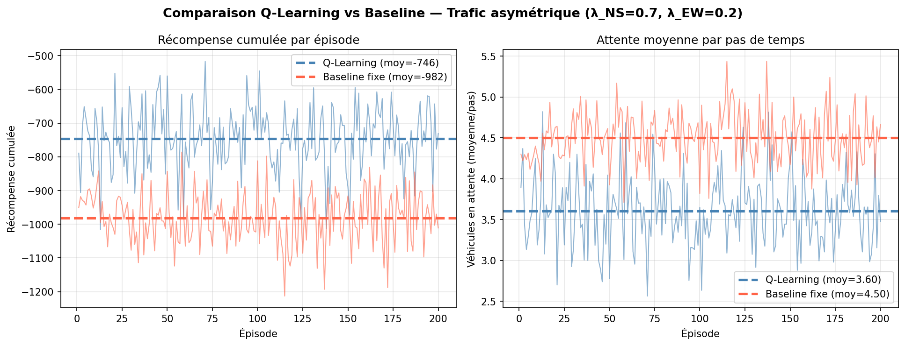

# Gestion Intelligente du Trafic Urbain

Projet - Partie 1 : Agent Q-Learning pour le contrôle d'un carrefour isolé


## Description

Ce projet implémente un agent intelligent basé sur l'apprentissage par renforcement (Q-Learning) pour optimiser la gestion des feux de signalisation d'un carrefour urbain à quatre branches. L'objectif est de minimiser le temps d'attente total des véhicules en adaptant dynamiquement les phases du feu en fonction de l'état du trafic.

## Installation

### Prérequis

- Python 3.8+
- pip

### Installation des dépendances

```bash
# Créer un environnement virtuel
python -m venv venv

# Activer l'environnement virtuel
source venv/bin/activate  # Linux/Mac
# ou
venv\Scripts\activate  # Windows

# Installer les dépendances
pip install numpy matplotlib pygame-ce
```

## Utilisation

### Entraînement

```bash
python train.py
```

Les agents entraînés sont sauvegardés dans le dossier `outputs/`.

### Évaluation

```bash
python evaluate.py
```

Génère les figures de comparaison dans le dossier `outputs/`.

### Visualisation interactive

```bash
python visualizer.py
```

Contrôles :
- `[1/2/3]` : Mode Manuel / Baseline / Q-Learning
- `[C]` : Mode Comparaison (Baseline vs Q-Learning)
- `[4/5]` : Trafic équilibré / asymétrique
- `[SPACE]` : Pause / Reprendre
- `[+/-]` : Ajuster la vitesse
- `[R]` : Réinitialiser
- `[ESC]` : Quitter

## Résultats

### Visualisation du carrefour



### Convergence de l'apprentissage



La courbe montre l'amélioration progressive de la récompense cumulée au cours de l'entraînement.

### Décroissance de l'exploration



Le paramètre epsilon décroît géométriquement, permettant une transition progressive de l'exploration vers l'exploitation.

### Analyse de sensibilité





L'analyse montre l'impact des hyperparamètres sur les performances.

### Comparaison des performances





**Scénario 1 : Trafic équilibré**
- Q-Learning : 4,06 véhicules/pas
- Baseline : 3,87 véhicules/pas
- Gain : -4,9% (performances comparables)

**Scénario 2 : Trafic asymétrique**
- Q-Learning : 3,60 véhicules/pas
- Baseline : 4,50 véhicules/pas
- Gain : +20,0% (réduction significative)

## Structure du projet

```
.
├── simulation.py      # Environnement du carrefour (MDP)
├── agent.py           # Agents Q-Learning et Baseline
├── train.py           # Boucle d'entraînement
├── evaluate.py        # Évaluation et analyse comparative
├── visualizer.py      # Visualisation interactive
├── main.py            # Point d'entrée principal
├── rapport.tex        # Rapport technique LaTeX
├── figures/           # Figures pour le rapport
└── outputs/           # Agents entraînés
```

## Formalisation MDP

### Espace d'états

```
s_t = (q_N, q_S, q_E, q_O, φ)
```

- `q_i ∈ {0, 1, 2, 3, 4, 5}` : longueur discrétisée de la file i
- `φ ∈ {NS, EO, orange}` : phase courante

### Actions

```
A = {0 = Maintenir, 1 = Changer}
```

### Récompense

```
R(s_t) = -Σ q_i^(t) - 2 · Σ 1[q_i^(t) = 5]
```

## Hyperparamètres

| Paramètre | Valeur |
|-----------|--------|
| Taux d'apprentissage α | 0,10 |
| Facteur d'actualisation γ | 0,95 |
| Exploration initiale ε₀ | 1,00 |
| Exploration minimale ε_min | 0,05 |
| Décroissance ε | 0,995 |
| Capacité file Q_max | 5 véhicules |
| Épisodes entraînement | 1000 |
| Pas par épisode | 200 |


